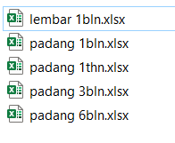

---
title: Multi Processing Data Pasut Dengan T_Tide
date: 2020-02-26
slug: pengolahan-pasut-ttide-multiprocess
tags: 
- T-Tide
- Matlab
- Pasut
categories : 
- Hidrografi
typora-root-url: ./
---

Terkadang kita mendapatkan banyak data pengamatan pasut yang harus diolah untuk mendapatkan konstanta harmonik tiap stasiun pengamatan. Semisal saat kita ingin membuat peta co-tidal, yang menggunakan banyak stasiun pasut sebagai sumber datanya dan mengambil komponen harmoniknya untuk diolah.

Disini saya mencoba menyusun script yang bisa membantu mengolah banyak file data pengamatan dalam sekali running dan selanjutnya seluruh hasil dari pengolahan akan disimpan dalam folder **Report**. 

File data yang digunakan dalam bentuk excel dan semua bisa di download :floppy_disk: **[disini](https://1drv.ms/u/s!AlFYwWWftV2zmWrL9WR4Nbc34Y1s?e=EHp7Dv)**. 

- Simpan data pengamatan dalam kolom Tahun, Bulan, Tanggal, Jam, Menit, Detik, Tinggi dan lintang stasiun pengamatan dalam desimal degree
- Seluruh file excel yang akan di proses kita simpan dalam folder, misalnya nama folder **data**
- Selanjutnya kita running script **multipleproc.m**
- Ketika muncul jendela dialog, pilih folder tempat kita menyimpan filenya, dalam hal ini folder **data**

- Setelah memilih folder data yang kita pakai, maka selanjutnya T\_Tide akan langsung memproses seluruh datanya dan kemudian hasilnya akan tersimpan di folder baru bernama **Report**

Script ini juga masih bisa dikembang lebih lanjut untuk keperluan lainnya, karena prinsipnya hanya memanfaatkan perintah matlab saja, semoga bermanfaat, makasih.. :D

