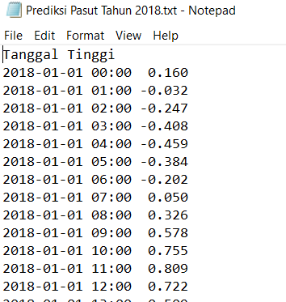

---
title: Pengolahan Data Pasang Surut Menggunakan T_Tide (Bagian 2)
date: 2020-02-28
slug: pengolahan-pasut-ttide-2
tags: 
- T-Tide
- Matlab
- Pasut
categories : 
- Hidrografi
typora-root-url: ./
---

Postingan ini melanjutkan dari post [sebelumnya](https://geodesiana.com/2020/02/pengolahan-data-pasang-surut-menggunakan-ttide/), pada tulisan kali ini kita akan sedikit memodifikasi script untuk analisa dan prediksi menggunakan T_Tide.

Pada script ini saya menambahkan contoh perintah untuk membuat **grafik rekonstruksi pasut, grafik prediksi pasut** dan perintah **menyimpan file hasil prediksi dalam format file excel dan text**. Scriptnya bisa download di bawah ini.

**[Script Analisa dan Prediksi](https://1drv.ms/u/s!AlFYwWWftV2zmWiz7jst5cT8kXp2?e=KjKkJN)**

Dari script yang saya susun, nanti temen-temen tinggal mengedit beberapa hal seperti dibawah ini :

```matlab
%input file
data=load('padang2015.txt');

%nama output
outputname='padang 2015';

%posisi lintang stasiun pengamat
%lintang selatan negatif
lat=-1*(0+59/60+48/3600);

%waktu awal dan akhir untuk prediksi
tawal=datenum('01/01/2018 00:00','dd/mm/yyyy HH:MM');
takhir=datenum('31/12/2018 23:00','dd/mm/yyyy HH:MM');

%nama output prediksi
predictname='Prediksi Pasut Tahun 2018';
```

a. Pada `data=load('padang 1thn.txt');` ganti padang 1thn.txt dengan nama file data kalian  
b. Di `outputname='Padang 2015';` ganti nama Padang 2015 dengan nama output yang kalian inginkan  
c. Di `lat=-1*(0+59/60+48/3600);` ganti lintang posisi stasiun pengamat dalam desimal degree  
d. Di `tawal=datenum('01/01/2018 00:00','dd/mm/yyyy HH:MM');` ganti 01/01/2018 00:00 dengan waktu awal yang kalian inginkan untuk memulai prediksi begitu juga dengan takhir  
e. Di `predictname='Prediksi Pasut Tahun 2018';` ganti Prediksi Pasut Tahun 2018 dengan nama output hasil prediksi yang kalian inginkan

Setelah script kita jalankan akan muncul tampilan sebagai berikut, tunggu hingga **SELESAI**.


Script ini akan menghasilkan  
* file **hasil analisa**,  

* file **hasil prediksi**,  

* **Grafik rekonstruksi** dari data pengamatan pasut dengan hasil pengolahan T_Tide,  

* **Grafik residu** atau selisih antara pengamatan dan pengolahan T_Tide, dan  

* **Grafik prediksi** pasutnya, seluruh grafik dan file hasil pengolahan akan tersimpan dalam folder **Report**. 

File yang dihasilkan adalah sebagai berikut :





_Perbandingan hasil observasi dan pengolahan beserta residunya_

Oke sekian untuk postingan tentang analisa harmonik dan prediksi pasut, selanjutnya bisa dikembangkan sesuai tujuan masing masing, semoga bermanfaat dan terimakasih :D

Sumber:  
**R. Pawlowicz, B. Beardsley, and S. Lentz, "Classical tidal harmonic analysis including error estimates in MATLAB using T_TIDE", Computers and Geosciences 28 (2002), 929-937**

