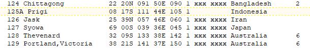

---
title: Pengolahan Data Pasang Surut Laut Menggunakan SLP64
date: 2020-11-07
tags: 
- SLP64
- Pasut
categories : 
- Hidrografi
typora-root-url: ./
slug: pengolahan-pasut-slp64
---

**SLP64** merupakan salah satu software yang khusus untuk mengolah data pasang surut air laut yang pertama kali dikembangkan pada tahun 1988.

Pada mulanya software ini dikembangkan menggunakan bahasa Fortran dengan nama awal **SLPRC**, kemudian berubah menjadi **SLPR2**. Kedua software ini dikembangkan under DOS operating system 16-32bit.

Setelah kemunculan sistem operasi 64bit, software ini berevolusi menjadi SLP64 dengan menggunakan bahasa pemrograman Python/matplotlib.

Fungsi utama dari SLP64 sendiri antara lain :
-  Analisa dan prediksi pasang surut
-  Quality Control
-  Filter nilai pasang surut perjam menjadi perbulan dan perhari
Pada artikel kali ini, yang dibahas hanya point pertama saja, yaitu analisa konstanta dan prediksi pasut.

Yak lanjot,, 
SLP64 bisa berjalan dalam sistem operasi linux dan Windows, kali ini saya memakai Windows10 Pro.

## **1. Installasi dan Manajemen Data**

- Untuk menjalankan SLP64 kita memerlukan software [SLP64](http://ilikai.soest.hawaii.edu/UHSLC/jasl/jaslsoft.html) itu sendiri dan [Python](https://www.python.org/downloads/) versi 2.7 *(Python versi terbaru sudah rilis sih tapi saya belum cobain :D )*, kedua software itu bisa di download di masing masing link di atas atau dalam drive saya sekaligus dengan contoh datanya di bawah ini.
- Setelah itu install Python, dan extract SLP64 hasil download kita tadi. Lalu pindahkan hasil ekstraksi SLP64 ke dalam **Drive C:**
- Pada tutorial ini saya memberikan contoh data dalam format **CSV** dengan *comma delimiter* dan satuan tinggi pasutnya dalam **milimeter**.
- Contoh data yang saya sertakan adalah data dari **stasiun Prigi**, interval pengamatan **per jam**, durasi pengamatan selama satu tahun.
- Seluruh data yang ingin kita olah (format CSV), kita letakkan dalam folder **DAT** yang ada dalam folder slp64.

**[Bahan SLP64](https://1drv.ms/u/s!AlFYwWWftV2zmxyS8TvFjKWfiZTp?e=emj8pN)**

## **2. Setup Informasi Stasiun Pasut**

- Selanjutnya langkah yang diperlukan adalah mengatur file **STAsion INFormation Data INput (STAINFO.DIN)** yang ada dalam folder **DIN**, buka file ini dengan notepad atau aplikasi pembaca text lainnya.
- Jika kalian lihat meta data yang disertakan, kalian bisa lihat nomor stasiun pasutnya dalam nama **JASL** dan informasi lainnya. 

- File **STAINFO.DIN** berisi **nomor stasiun** (sesuai yang terdaftar dalam [UHSLC](https://uhslc.soest.hawaii.edu/)), **nama stasiun, latitude, longitude, time meridian,** skema waktu, waktu pertama stasiun aktif, **negara** dan plot factor. List data yang berwarna hijau di atas tidak digunakan dalam perhitungan jadi bisa dikosongkan atau ikut data di atasnya.

- Beberapa stasiun pasut Indonesia sudah terdaftar dalam UHSLC, seperti contoh stasiun **Prigi** di atas, jika ada perbedaan antara nomor stasiun di File **STAINFO.DIN** dan metadata, tinggal disesuaikan aja dengan yang ada di metadata.
  Terkadang ada stasiun pasut Indonesia yang belum ada dalam File **STAINFO.DIN**, jadi kita perlu membuat definisi baru dari stasiun pasutnya, seperti contoh di bawah ini stasiun semarang dengan nomor stasiun 923**.**

## **3. Konversi Data Pengamatan**

Konversi data ini bertujuan untuk mengubah format data pengamatan ke dalam format yang bisa dibaca oleh SLP64, programnya adalah csv\_to\_fixed\_columns.py dan convert.py yang ada dalam folder **UTIL.** OK, waktunya buka *command prompt* genks,,

- run program csv\_to\_fixed\_columns.py, lalu akan keluar beberapa perintah isian seperti di bawah ini
- *Originator CSV filename* : isi dengan nama file csv kita, ingat besar kecil hurufnya ya.
- *Is there a missing flag data?* : ketik **n** (no) saja
- *Output filename* : isi nama output dengan format ekstensi **.dat**
- *Code for number of decimals* : pilih **satu (1)** karena satuan yang kita pakai adalah milimeter, jadi tidak angka dibelakang koma
- Setelah itu output file nya akan tersimpan dalam folder **DAT**
- Ulangi untuk file CSV lainnya

- run program convert.py, lalu akan keluar beberapa perintah isian seperti di bawah ini
- *Originator filename* : isi dengan nama file **DAT** kita, ingat besar kecil hurufnya ya, contoh file **prigi.dat**.
- *Time zone of original data* : isi dengan time meridian seperti yang ada dalam meta data atau STAINFO, untuk prigi 105E
- *Code for sea level data format* : pilih 1 karena satuan data dalam milimeter
- *File version of SLP64 format output file* : untuk pertama isi aja dengan **a**, ini untuk menunjuk urutan versi pengolahan dari data yang sama
- *Station number* : isi dengan nomor stasiun number seperti yang dibuat dalam STAINFO, untuk prigi adalah 125.
- Output akan tersimpan di folder **DAT**, misal **wa12517.dat** berarti sequance process ke-a, station number 125 tahun 2017.
- Ulangi untuk file DAT lainnya

- Jika data yang kita pakai memiliki banyak kekosongan data, maka kita perlu melakukan melakukan pengisian gap data dengan perintah **fillvm.exe** yang ada dalam folder **util.** Hasil dari pengisian data kosong akan disimpan dalam folder **dat** dengan nama file adalah **fill.** 
- Karena data yang dipakai disini tidak ada kekosongan data maka tidak dilakukan pengisian gap data.

## **4. Analisa Harmonik Pasut**

Setelah semua data sudah siap dan sesuai format, proses analisa untuk mencari nilai konstanta harmonik pasang surut adalah seperti berikut :

- Masuk ke folder **Tide**, kemudian ke dalam folder **ana** lalu jalankan perintah **TIDEANL.BAT**
- Setelah program berjalan, akan muncul perintah untuk memasukkan nomor statiun pengamatan yaitu **125** (*enter station number : 125*)
- Kemudian akan muncul informasi stasiun pengamatan seperti yang ada dalam file **stainfo.din,** jika tidak perlu merubah data, pilih **N** (*do you need to modify any of the above : N*)

- Selanjutnya pilih **Y** untuk waktu yang bereferensi pada local time
- Masukkan waktu dimulainya pengamatan dalam format HHDDMMYYYY, **0001012017**
- Lalu masukkan waktu terakhir pengamatan, **2331122017**
- Masukkan keterangan versi output file misalnya dengan huruf **A**
- Setelah proses selesai, hasil pengolahan akan tersimpan dalam folder **harm** yang ada di dalam folder **Tide** dengan nama **HARM125.LIS** dan **INP125.PRD**

Konstanta Harmonik dalam file HARM125 

Dari hasil diatas bisa didapat

- Unit satuan dalam sentimeter
- Z0 = nilai Z0 disini adalah nilai MSL dari titik nol palem atau titik nol sensor pengamatan
- A = Nilai Amplitudo 
- G = go = Nilai Fase dalam derajat

## **5. Prediksi Pasut**

Selain untuk mendapatkan nilai konstanta harmonik, fitur SLP64 yang lain adalah untuk melakukan prediksi pasang surut. Langkahnya adalah sebagai berikut :

- Pada command prompt, masuk ke folder **pyprd** yang ada di dalam folder **tide**, lalu jalankan perintah **tideprd.py**

(Perintah **tideprd.py** digunakan untuk melakukan prediksi yang lebih dari satu tahun secara serentak berurutan, sedangkan untuk melakukan prediksi per tahun atau satu per satu menggunakan perintah **tideprd.bat**)

- Kemudian isikan data parameter sesuai instruksi yang diberikan
- File version for output predicted tides file (eg. a): A
- *Station number (eg 003): 125*
- *Start year for prediction (eg 2008): 2018*
- *End year for prediction (eg 2008) : 2020*
- *Time Zone Reference of Predictions : 105*
- *Code for desired output type : 1* (pilih opsi 1 untuk menghasilkan data prediksi per jam)
- Selanjutnya hasil prediksi per tahun akan disimpan dalam folder **prd** yang ada di dalam folder SLP64, unit satuan dalam hasil prediksi adalah milimeter.

Contoh hasil prediksi

- Cara membaca hasil prediksi diatas adalah dengan melihat urutan data yang disusun per 12 jam. Contoh 2018 1 11 adalah tahun 2018 bulan 1 tanggal 1 baris 1 (jam 1 - 12), 2018 1 11 adalah tahun 2018 bulan 1 tanggal 1 baris 2 (jam 13 - 24).

Oke deh, secara sederhana proses pengolahan data pasut menggunakan SLP64 adalah seperti yang dijelaskan di atas, apabila ingin mengembangkan atau memproses data pasut lebih lanjut seperti plot data pasut, kontrol kualitas data dsb silakan dilihat pada petunjuk manual yang disertakan dalam link download data diatas. Semoga bermanfaat.

Referensi :
Caldwell, Patrick. 2014. *Hourly Sea Level Data Processing and Quality Control Software : SLP64 User Manual*. 4th ed. Honolulu: University of Hawaii Sea Level Center.

