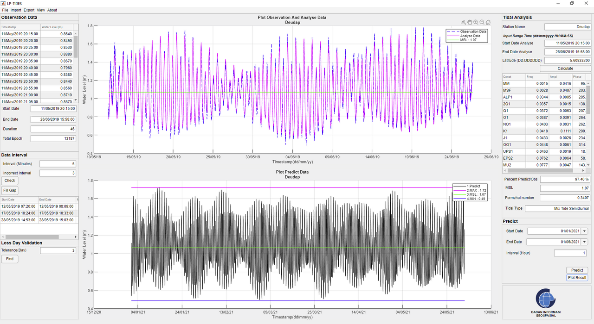
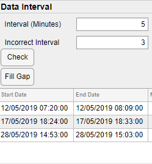
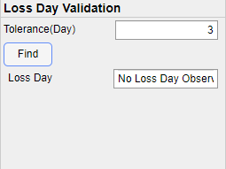
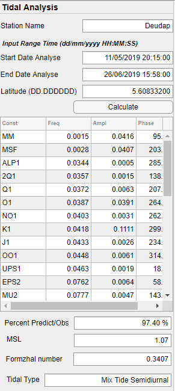
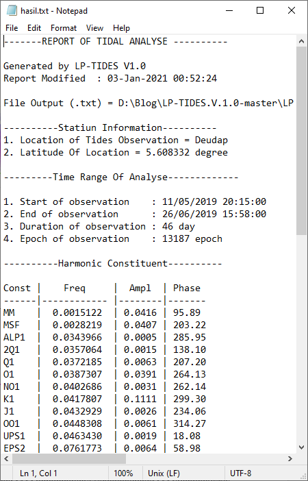
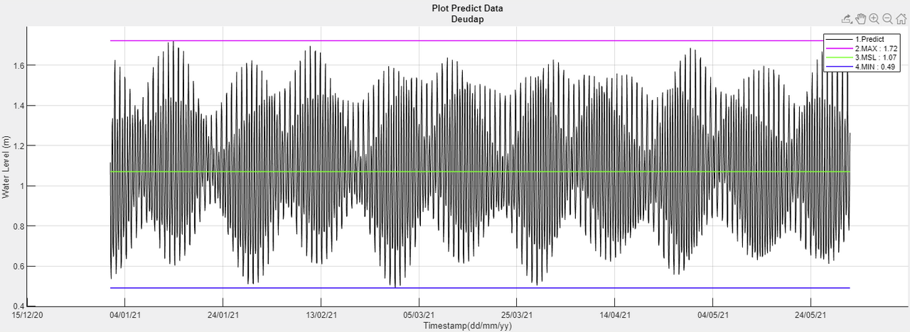
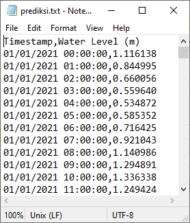

Sampai saat ini T_Tide masih menjadi program pengolah data pasang  surut yang populer di kalangan akademisi. Banyak sekali penelitian yang  berkaitan atau memanfaatkan data pasang surut diproses menggunakan  program ini. 

Selain karena sifatnya yang gratis, banyaknya fitur yang disematkan  dan kemudahan dalam kustomisasi program T_Tide menjadikan alasan program ini banyak digunakan. 

Akan tetapi dasar pemrograman T_Tide yang menggunakan Matlab  terkadang menyulitkan bagi pengguna yang tidak memiliki dasar dalam  menggunakan matlab.

Disinilah LP-Tides ada untuk mempermudah dalam proses pengolahan data pasang surut itu, karena bisa dibilang LP-TIdes adalah program T_Tide  yang memiliki GUI atau interface yang memudahkan pengguna untuk  mendapatkan hasil dengan cara klak klik saja 😂.

LP_Tides dikembangkan oleh mas **Teguh Sulistian** yang merupakan salah seorang peneliti di Pusat Kelautan dan Lingkungan Pantai, Badan Informasi Geospasial.

Program ini bukanlah program yang berdiri sendiri, melainkan tetap  berjalan dalam aplikasi matlab, maka dari itu sebelum menggunakannya  kita perlu menginstall terlebih dahulu aplikasi Matlab dengan minimum  versi matlab 2019 atau Matlab Runtime dengan minimum versi 2019b.

Contoh tampilan program LP-Tides

Program ini membawa fitur dasar dari T-Tide, yaitu **analisa konstanta harmonik dan prediksi pasang surut**. Program ini juga dapat menyajikan grafik dari hasil observasi, rekonstruksinya dan grafik prediksinya.

Selain itu, LP-Tides juga terdapat fitur **Loss Day Validation** yang berfungsi untuk melakukan pengecekan gap dari data pengamatan dan fitur **Fill Gap** yang berfungsi untuk mengisi kekosongan dari gap data.

Fitur Fill Gap

Fitur Loss Day Validation

Hasil dari analisa harmonik dan prediksi pasut juga dapat disimpan dalam format text ke dalam folder yang di inginkan.

Hasil analisa dalam tampilan LP-Tides

Eksport hasil analisa dalam format text

Contoh grafik prediksi

Eksport hasil prediksi dalam format text

Tutorial, contoh data dan program LP-Tides ini dapat di download langsung di channel github milik mas Teguh Sulistian
[ https://github.com/teguhsulistian/LP-TIDES.V.1.0](https://github.com/teguhsulistian/LP-TIDES.V.1.0)
Atau 
melalui tombol di bawah ini untuk langsung mendownload dalam format zip.

[LP-Tides Github](https://github.com/teguhsulistian/LP-TIDES.V.1.0/archive/master.zip)

Semoga bermanfaat dan jangan lupa untuk tetap menyertakan keterangan  hak cipta dari setiap program, script atau artikel yang kita gunakan 😀