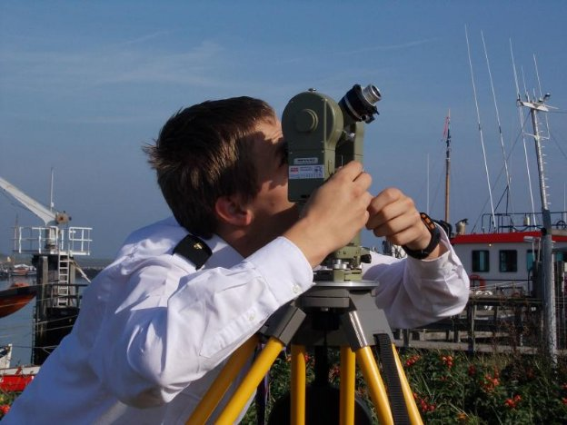
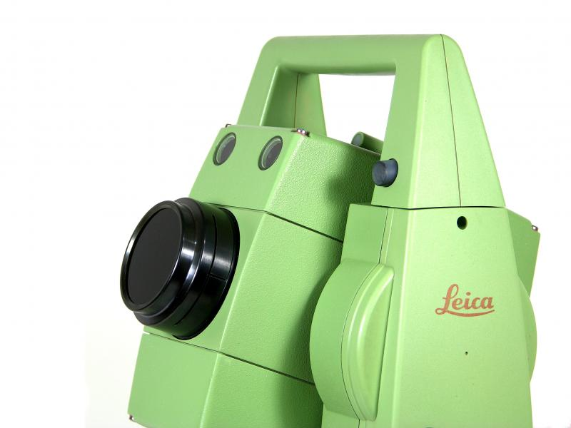
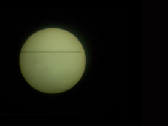
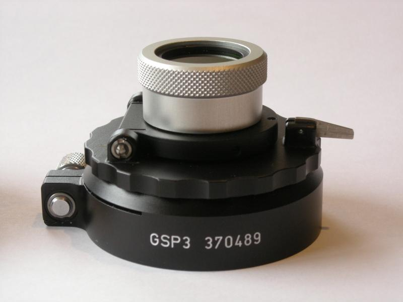
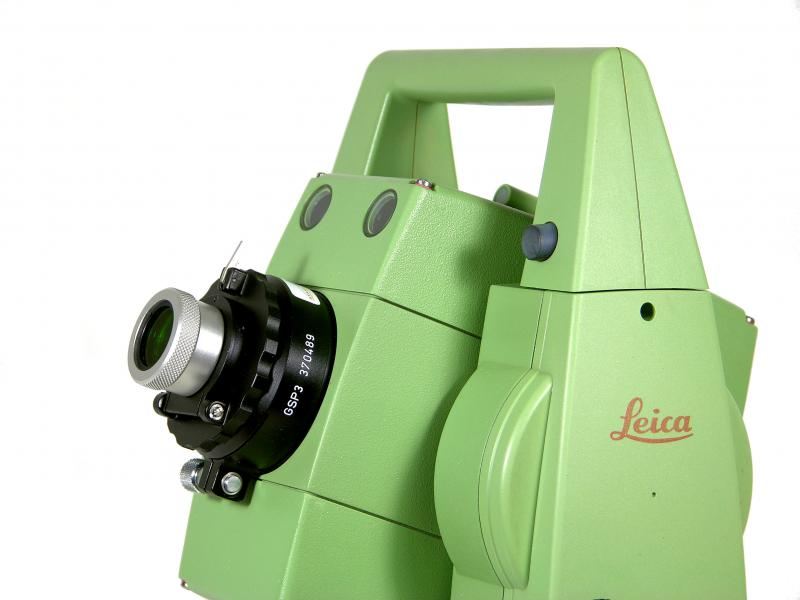
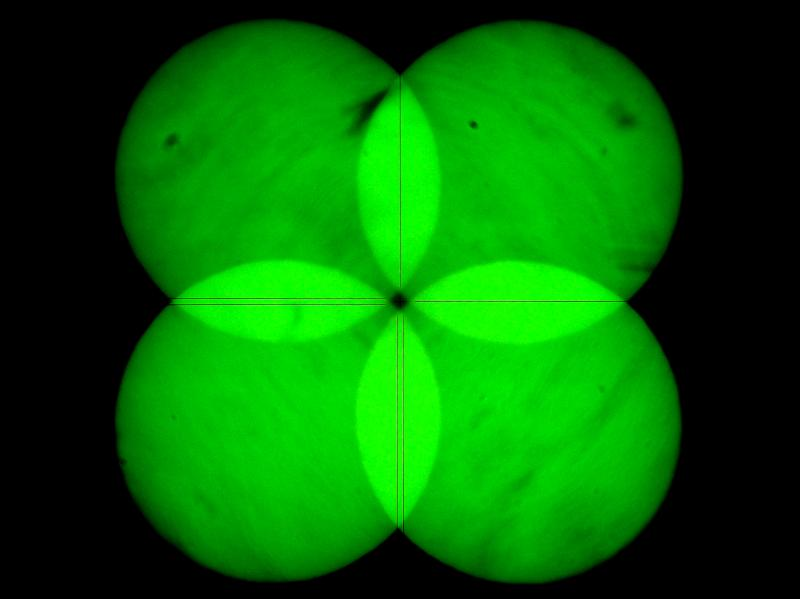
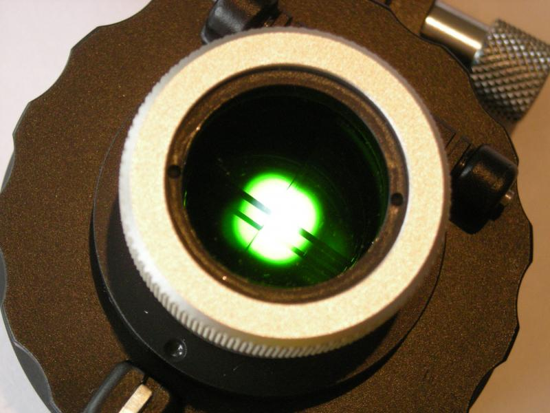
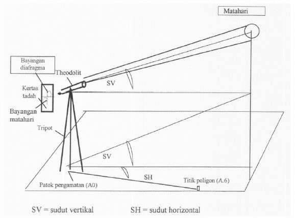
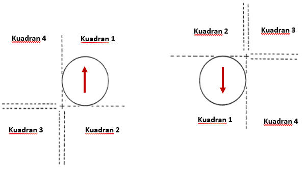

---
title: Penentuan Azimuth Dengan Pengamatan Matahari - Bagian 1
date: 2021-01-11
draft: false
tags: 
- Sunshot
- Azimuth
categories : 
- Topografi
typora-root-url: ./
thumbnail : "./thumbnail.jpg"
featureImage: "./thumbnail.jpg"
toc: true
slug: penentuan-azimuth-1
---

## **A. Pendahuluan**

Dalam pemetaan topografi, terdapat empat komponen dalam survey pengukuran yang digunakan untuk menenentukan posisi titik di permukaan bumi. Empat komponen itu adalah *Vertical (elevations), horizontal (distances), relative direction (angles)* dan *absolute direction (azimuths)*.

Mayoritas pekerjaan dalam survey pemetaan, terutama yang menggunakan jaring poligon, membutuhkan nilai azimuth sebagai pengikat dalam orientasi data ke utara sebenarnya atau utara geografis. Beberapa metode untuk mendapatkan azimuth yaitu :

- Azimuth dengan kompas
- Azimuth dengan dua titik pengukuran yang sudah diketahui koordinatnya
- Azimuth dengan pengamatan matahari *(sun shot)*

Pengamatan matahari menggunakan theodolit *Wild T2* dan Prisma Roelofs (Sumber : http://www.dehilster.info)

Azimuth dengan pengamatan matahari merupakan salah satu metode dalam menentukan azimuth dengan memanfaatkan benda angkasa *(Celestial body)*.

Saat ini, metode penentuan azimuth dengan pengamatan matahari *(sun shot)* sudah sangat jarang dilakukan, karena metode ini sudah tergantikan dengan penentuan azimuth menggunakan dua titik koordinat yang didapat melalui pengamatan gps, yang mana cara ini menghasilkan nilai azimuth lebih teliti.

Walau sangat jarang digunakan, pada kondisi tertentu metode *sun shot* ini menjadi satu satunya cara untuk mendapatkan nilai azimuth. Beberapa kegiatan yang masih menggunakan metode ini diantaranya :

- Kalibrasi heading gyrocompass pada kegiatan Offshore Rig Move
- Pengikatan azimuth ketika tidak ada 2 titik kontrol tetap, biasanya untuk kegiatan survey di remote area atau wilayah terpencil

## **B. Metode Membidik Matahari**

Pengamatan matahari bisa dilakukan dengan berberapa cara tergantung pada peralatan yang digunakan, yaitu :

### **1. Pengamatan dengan filter gelap**

Pengamatan ini menggunakan filter gelap yang dipasang pada lensa objektif, matahari diamati secara langsung dengan menyinggungkan benang silang pada tepi-tepi matahari (*Quadrant Method*).

Filter gelap pada Total Station Leica 

Persinggungan benang silang dengan tepi matahari

Pada saat pengamatan, sketsa arah gerak dan posisi matahari pada kuadran juga perlu digambarkan. Hal ini untuk menentukan koreksi setengah diameter matahari dalam perhitungan, koreksi ini perlu karena azimuth matahari sebenarnya dihitung terhadap titik pusat matahari. Di pagi hari pada teropong tegak, bayangan matahari akan terlihat naik, sedangkan waktu sore akan terlihat turun.

Contoh sketsa posisi matahari dalam kuadran dan arah geraknya

### **2. Pengamatan dengan memakai prisma Roelofs**

Metode pengamatan ini menggunakan prisma khusus yang disebut prisma Roelofs, prisma ini dipasang pada lensa objektif, sehingga pengamat bisa dengan langsung membidik pusat matahari.

Prisma Roelofs

Prisma Roelofs Pada Total Station Leica

Efek yang dihasilkan dari prisma ini adalah tampilan visual berupa 4 bayangan matahari di tiap kuadran dengan warna hijau monochromatik, perpotongan antara keempat bayangan ini merupakan titik pusat matahari.

Pusat matahari dilihat dengan prisma Roelofs

Bayangan hijau monochromatik dalam prisma roelofs

Keuntungan menggunakan Prisma Roelofs ini adalah :

- Ketelitian pengamatan tinggi
- Tidak ada kesalahan dalam menyinggungkan benang silang dengan bayangan matahai
- Benang silang selalu dapat dilihat dengan jelas
- Tidak ada keragu-raguan tentang pemilihan kuadran dan macam koreksinya.

### **3. Pengamatan dengan menadah bayangan matahari (tanpa filter)**

Apabila tidak ada peralatan khusus seperti yang disebutkan diatas, maka pengamatan matahari secara langsung tidak dapat dilakukan. Maka cara yang dapat dilakukan adalah dengan menadah bayangan matahari di belakang lensa okuler dengan menggunakan kertas putih.

Lensa pada total station/theodolit diatur sedemikian rupa sehingga didapat bayangan bulat matahari dan benang silang pada kertas, dan selanjutnya tepi matahari disinggungkan dengan benang silang seperti metode menggunakan filter gelap diatas (*Quadrant Method*).

Ilustrasi menadah bayangan matahari

Pada saat pengamatan, sketsa arah gerak dan posisi matahari pada kuadran juga perlu digambarkan. Hal ini diperlukan untuk menentukan koreksi setengah diameter matahari dalam perhitungan. Di pagi hari, bayangan matahari bergerak naik, sedangkan waktu sore akan bergerak turun. Hal ini perlu diperhatikan pada bayangan matahari yang dihasilkan, agar tidak terjadi kesalahan perhitungan disebabkan pembacaan sudut yang salah saat menyinggungkan benang silang, karena pada teropong tertentu justru bayangan matahari akan bergerak sebaliknya.

Contoh pada gambar dibawah ini, semisal pengamatan dilakukan pada pagi hari dalam kuadran satu, jika pergerakan bayangan terbalik maka pembagian kuadran juga mengikuti.

Pergerakan matahari

## **C. Metode Penentuan Azimuth Matahari**

Pada pengamatan matahari, jika mengetahui lokasi geografis (lintang dan bujur), data [ephemeris](https://en.wikipedia.org/wiki/Ephemeris) dan waktu atau ketinggian, maka nilai azimuth dapat dihitung.

Jika waktu yang digunakan, maka prosedur yang digunakan dikenal sebagai **Metode Sudut Waktu (*hour angle method*)**, dan apabila menggunakan data ketinggian maka disebut dengan **Metode Tinggi Matahari *(altitude method)***.

Perbedaan mendasar dari kedua metode tersebut yaitu, pada metode **tinggi matahari** membutuhkan **waktu perkiraan dan sudut vertikal yang akurat**. Sedangkan pada metode **sudut waktu** membutuhkan **waktu yang akurat** **dan tidak memerlukan data sudut vertikal**.

Untuk proses perhitungan dan prosedur pengamatan akan dilanjutkan pada postingan berikutnya. Semoga bermanfaat :D

Referensi :
- Brinker, Russell Charles, and Roy Minnick. *The Surveying Handbook*. 2nd ed., Springer-Science-Business Media, B.V., 1995.
- Kartawiharja, Basuki. *Penentuan Asimut Dengan Pengamatan Matahari*. Yogyakarta : Kanisius. 1988
- Supardjo, dkk. *Penentuan Azimut Matahari Dalam Pemetaan Topografi di Rirang Kalimantan Barat*. Prosiding Seminar Pranata Nuklir dan Teknisi Litkayasa P2BGN - Batan. 2000

Sumber Gambar : http://www.dehilster.info
