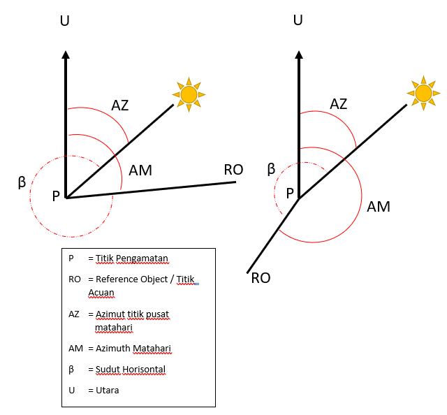
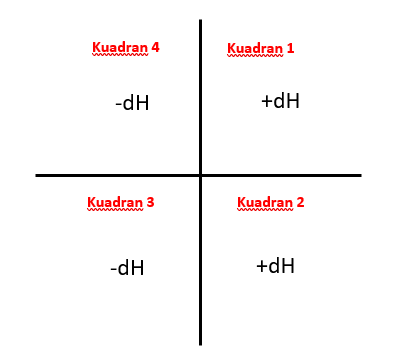
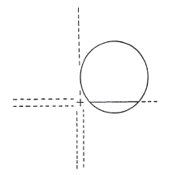

## **A. Prosedur Pengamatan**

Dalam melakukan pengamatan langkah yang diperlukan adalah :

### **1. Persiapan Alat dan Bahan**

Persiapan alat dan bahan dalam melakukan pengamatan matahari untuk menentukan azimuth antara lain :

- Satu set Theodolit atau Total Station dengan ketelitian yang baik
- Alat pendukung pengamatan matahari, seperti Prisma Roelof, filter gelap atau kertas putih sebagai kertas tadah
- GPS handheld atau peta topografi pada wilayah pengamatan untuk menentukan lokasi geografis di lokasi pengamatan.
- Penunjuk waktu yang akurat hingga ketelitian detik atau mili detik, bisa menggunakan waktu pada smartphone yang terhubung jaringan telekomunikasi atau waktu dari GPS receiver
- Formulir Pengamatan
- Termometer atau Barometer *(Opsional)*
- Tabel data ephemeris terbaru, bisa menggunakan almanak nautika atau tabel deklinasi matahari dari DITTOPAD (Direktorat Topografi TNI Angkatan Darat) *(Opsional)*

### **2. Langkah Pengamatan**

- Dirikan alat (Theodolit/Total Station) diatas titik pada area yang terbuka atau bisa melihat matahari
- Sentring alat seperti biasa (Nivo Vertikal dan Horisontal)
- Pada posisi teropong **Biasa (*Direct*)**, bidik titik acuan atau *Reference Object* dan catat bacaan sudut horisontalnya. Biasanya untuk mempermudah pada pembacaan pertama di **set 0 (Nol)** - **Bacaan 1**
- Buka kunci horisontal dan vertikal dan bidik ke arah matahari sesuai alat pendukung pengamatan yang digunakan. Biasanya teropong diputar searah jarum jam (*Clockwise*). Catat sudut bacaannya - **Bacaan 2**
- Ubah menjadi posisi **Luar Biasa (Reverse)** dan bidik kembali ke arah matahari - **Bacaan 3**
- Masih dalam posisi ***reverse***, bidik kembali ke arah titik acuan (*Reference Object*) - **Bacaan 4**
- Catat Koordinat lintang pada lokasi pengamatan (D-M-S) dan jangan lupa untuk membuat sketsa matahari pada kuadran dan arah pergerakannya.
- **Bacaan 1 - 4 merupakan bacaan satu set**. Untuk mendapatkan azimuth yang baik, minimal perlu dilakukan pengamatan sebanyak 2 set, yaitu pada masing - masing kuadran yang bersilangan, misal **kuadran 1 - kuadran 3** atau **kuadran 2 - kuadran 4**. Untuk hasil terbaik dilakukan pengamatan sebanyak 4 set, dengan tetap memperhatikan kuadran yang bersilangan, contoh urutan kuadran 1-3-2-4.
- Untuk meminimalisir kesalahan karena orbit semu harian matahari, maka pembacaan dari bacaan 2 hingga bacaan 3 diusahakan sesingkat mungkin.
- Pengamatan disarankan pada waktu pagi atau sore dimana ketinggian matahari kurang dari 45 derajat.

Contoh formulir untuk pengamatan di bawah ini, merupakan contoh formulir pengamatan dengan menyinggungkan benang silang dengan tepi matahari (*Quadrant Method*)

[**Contoh Fomulir Pengamatan**](https://1drv.ms/u/s!AlFYwWWftV2znyacuAfNjpyBPh0L?e=5ia1vB)

Pada masing - masing metode perhitungan azimuth matahari, data yang dicatat tiap bacaan tidak sama. Data yang dicatat dan data tambahan pada tiap metode yang digunakan antara lain :

| No | **Metode Tinggi Matahari** | **Metode Sudut Waktu** |
| :-:| :---:| :---: |
| 1 | Waktu tiap fix bacaan | Waktu tiap fix bacaan |
| 2| Sudut Horisontal | Sudut Horisontal |
| 3 | Sudut Vertikal | Koordinat Lokasi |
| 4 | Koordinat Lokasi | Tabel Data Ephemeris |
| 5 | Temperatur Lokasi Pada Waktu Pengamatan | |
| 6 | Tekana Udara / Elevasi Lokasi (*pilih salah satu*) | |

## **B. Metode Perhitungan Azimuth Matahari**

### **1. Metode Sudut Waktu (Hour Angle Method)**

Rumus umum Azimuth Matahari untuk Metode sudut waktu adalah sebagai berikut

$$
AZ = \tan^{-1} \frac{-\sin LHA}{\cos \phi \tan \delta - \sin \phi \cos LHA}
$$

LHA = Local Hour Angle  
$\phi$ = Deklinasi  
$\delta$ = Koordinat Lintang / Latitude  

a. Langkah pertama dalam proses perhitungan adalah mengkonversi waktu tiap pengamatan dari ***local time*** ke dalam ***Universal Time (GMT)***. Untuk WIB **-7**, untuk WITA **-8**, untuk WIT adalah **-9**.

b. Selanjutnya adalah mencari data Ephemeris yang dibutuhkan (**Semi Diameter Matahari, LHA** dan **Deklinasi**), di sini saya mencarinya menggunakan almanak nautika. Untuk mencari data ephemeris digunakan waktu pada GMT. Nilai **LHA** tidak ditampilkan secara langsung pada almanak nautika, namun bisa dicari dengan rumus berikut

LHA = GHA - W$\lambda$ (barat longitude)

LHA = GHA - E$\lambda$ (timur longitude)

$\lambda$ = Koordinat bujur / Longitude

Nilai GHA pada rumus adalah GHA pada waktu pengamatan (dalam GMT). 
Untuk mendapatkannya adalah melalui tabel GHA dalam almanak nautika kemudian +/- dengan nilai ***increments*** nya

c. Kemudian mencari nilai deklinasi dan koreksinya serta nilai Semi Diameter matahari dari almanak nautika. Cara mencari nilai **Semi Diameter, LHA** dan **Deklinasi** bisa dilihat dari post dibawah ini

https://geodesiana.com/membaca-almanak-nautika-untuk-pengamatan-matahari/ 

d. Setelah nilai LHA, Deklinasi dan koordinat lintang didapatkan, kita bisa menghitung nilai Azimuth Pusat Matahari (AZ) dengan rumus di atas. Kemudian nilai AZ tersebut juga perlu dinormalisasi untuk mendapat nilai antara 0° - 360° dengan melakukan koreksi seperti tabel di bawah ini

| Nilai LHA | Koreksi jika AZ positif | Koreksi jika AZ Negatif |
| :--: | :---------------------: | :--: |
| 0 - 180$\degree$ | 180$\degree$ | 360$\degree$ |
| 180 - 360$\degree$ | 0$\degree$ | 180$\degree$ |

e. Pada metode singgung tepi matahari (quadrant method), kita perlu melakukan koreksi 1/2 diameter matahari (1/2 *dH*) untuk mendapatkan sudut sebenarnya pada titik pusat matahari. Rumusnya adalah sebagai berikut

$$
\begin{aligned}
h &= \sin^{-1} (\sin \phi \sin \delta + \cos \phi \cos \delta \cos LHA) \cr
dH &= (semidiameter) / \cos h 
\end{aligned}
$$

LHA = Local Hour Angle

*$\phi$* = Deklinasi

*$\delta$* = Koordinat Lintang / Latitude

Semidiameter = didapat dari almanak nautika

f. Selanjutnya hasil bearing atau bacaan sudut horisontal kita koreksi dengan +/- hasil perhitungan *dH* (**β Corr = β +/- dH**). Koreksi ini tergantung dimana kuadran posisi matahari saat diamati. Apabila benang silang berada dikiri matahari, dH ditambah ke sudut kanan, apabila dikanan matahari, kurangi.

g. Terakhir untuk mendapatkan azimut ke titik acuan (AM), rumusnya adalah 
**AM = AZ - β Corr**. Hasil dari AM juga perlu dinormasilasi hingga berada dalam rentang sudut 0° - 360°.

h. Hasil Azimuth Matahari pada titik acuan (AM) dari tiap set bacaan kemudian dirata-ratakan hingga akhirnya didapat azimuth akhir dari titik P ke titik acuan.

### **2. Metode Tinggi Matahari (Altitude Method)**

Referensi :
\- Brinker, Russell Charles, and Roy Minnick. *The Surveying Handbook*. 2nd ed., Springer-Science-Business Media, B.V., 1995.
\- Kartawiharja, Basuki. *Penentuan Asimut Dengan Pengamatan Matahari*. Yogyakarta : Kanisius. 1988